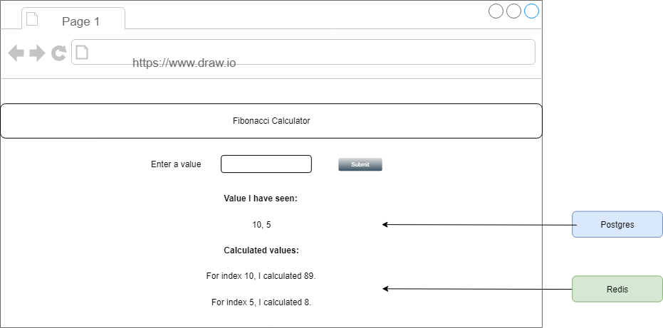
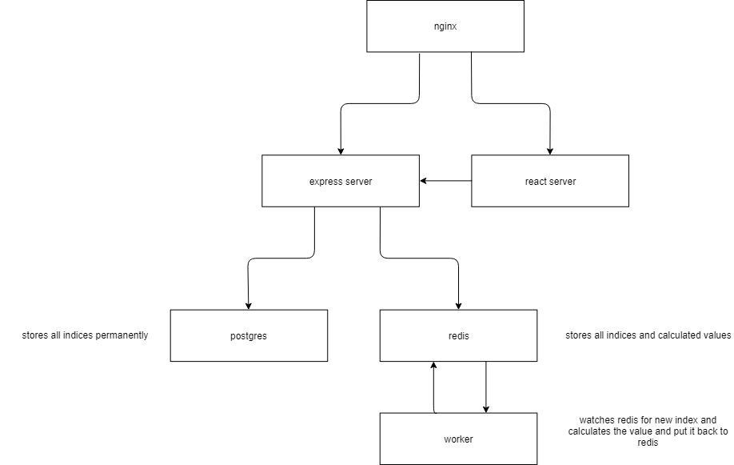
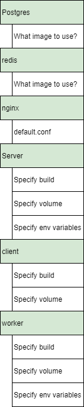
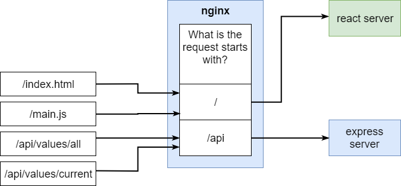

# How to Build a Multi-Container Application

## Fibonacci Application



## Six Containers

- Nginx
- REST API Server
- React Client
- Worker
- Postgres Database
- Reids Cache



## Docker Compose

```docker-compose.yml``` orchstrates the container network.



## The Purpose of The Nginx 

