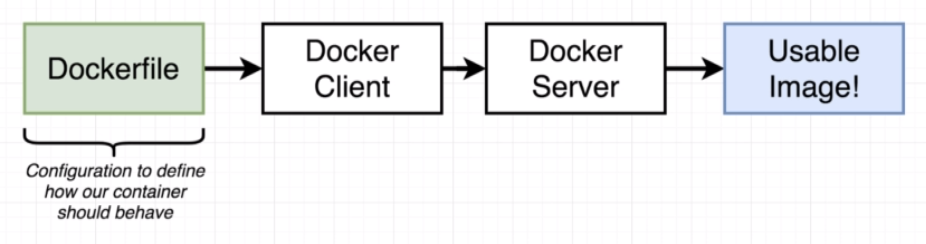

# Building Docker Images



## Dockerfile

It usually contains the following steps:
1. Specify a base image: ```FROM```
2. Install additional programs: ```RUN```
3. Specify a command to run on container startup: ```CMD```

## An Dockerfile Example

[Dockerfile](redis-image/Dockerfile)

## How to Build an Image

```SHELL
docker build .
```

Tag an image:
```shell
docker build -t <tag-name> .
```

Normally, a tag name follows the following convention: ```<docker-id>/<repo-name>:<version>```.

Run a docker image:
```SHELL
docker run <image-name>

docker run <tag-name>
```

Map a port 
```SHELL
docker run -p<source_port>:<target_port> <image-name>
```

## Tempoary Containers and Cache when Building an Image

An image is layered. A container is created from the base image. And additional commands are executed in that temporay container's files system and another image is created on top of the based image, and the temporary container is destroyed. This process is repeated until all the commands are executed. Each temporary container is cached.

## A Real Docker Project

See [Project simpleweb](simpleweb)