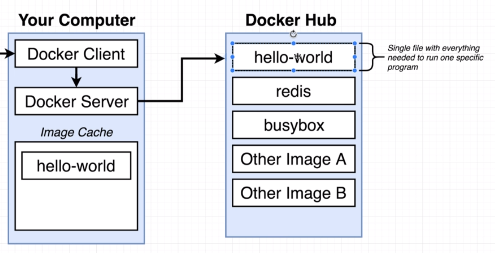
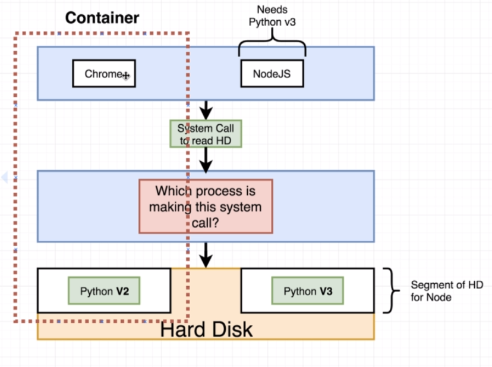
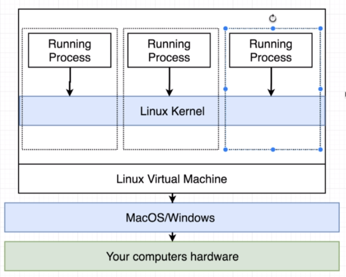

# Docker Intro 

## Why use Docker? What is Docker?

Docker makes it really easy to install and run software without worrying about setup or dependencies.

Docker is a platform or ecosystem around creating and running containers.
- Docker Client
- Docker Server
- Docker Machine
- Docker Images
- Docker Hub
- Docker Compose

## Docker Client, Docker Server, and Docker Hub

If a docker image is not found in the local image cache, it will be downloaded from the docker hub. 

## Containers are running processes

A docker image specifies a snapshot of a file system and a running command. When docker is running with that image, a portion of system resources are allocated for that particular docker process.

## Dockers are running on a Linux VM

